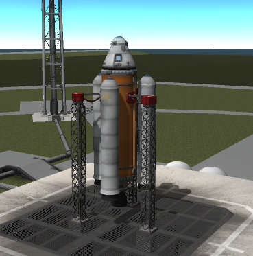

##第二章 教程和实例
这个系列的教程和例子说明如何使用kRPC的特性。它们是为Python客户端写的，不过概念适用于所有的客户端语言。

+ 亚轨道飞行
+ 参考坐标系
+ 发射入轨
+ 俯仰、航向和滚动
+ 零件交互控制（Interacting with Parts）
+ 对接指南

###2.1 亚轨道飞行
这个入门教程使用kRPC送一些小绿人在亚轨道飞行，并安全返回（希望）到Kerbin。它涵盖了以下主题：

+ 控制火箭（激活阶段activating stages，设置节流阀）
+ 使用自动驾驶仪指引飞行器到特定方向
+ 监控飞行器的燃料量
+ 跟踪飞行轨道数据（如高度和远拱点高度）

<table><tr><td bgcolor=#CCFFFF>
注意: 有关如何编写脚本和连接kRPC，请看入门指南。
</td></tr></table>
####2.1.1 第一部分 发射准备
本教程使用的2级火箭图片如下。这种火箭的工艺文件可以在这里[下载](http://krpc.github.io/krpc/_downloads/SubOrbitalFlight.craft)，整个的Python脚本在[这里](http://krpc.github.io/krpc/_downloads/SubOrbitalFlight.py)。
  

我们需要做的第一件事是加载客户端模块，打开到服务器的连接。我们还可以为我们的脚本起一个描述性的名字，它将出现在游戏里的服务器窗口中：

```python3

import krpc
conn = krpc.connect(name='Sub-orbital flight script')

```
下一步，我们需要得到一个对象，表示被激活的飞行器。正是通过这个对象，我们将指令发送给火箭：

```python3

vessel = conn.space_center.active_vessel

```
然后我们需要进行发射火箭前的准备。随后的代码设置节流阀至最大并且指示自动驾驶仪保持俯仰和航向为90°（垂直向上）。然后等待1秒让这些设置生效。
```python3

vessel.auto_pilot.target_pitch_and_heading(90,90)
vessel.auto_pilot.engage()
vessel.control.throttle = 1
import time
time.sleep(1)

```
####2.1.2 第二部分 发射！
我们现在准备通过激活第一阶段来发射（相当于按空格键）：
```python3

print('Launch!')
vessel.control.activate_next_stage()

```
火箭固体燃料的阶段，将很快耗尽，需要抛弃。我们可以监测火箭固体燃料的量，使用一个循环，反复检查火箭还有多少固体燃料。当循环退出时，我们将启动下一阶段抛弃助推器：
```python3

while vessel.resources.amount('SolidFuel') > 0.1:
    time.sleep(1)
print('Booster separation')
vessel.control.activate_next_stage()

```
在这段代码，`vessel.resources`返回一个`Resources(资源)`对象来得到关于火箭的资源信息。

####2.1.3 第三部分 到达远拱点
下一步，当火箭达到足够高的高度我们将执行一个重力转向。下面的循环将反复检查火箭的高度，当高度达到10km时退出循环：
```python3

while vessel.flight().mean_altitude < 10000:
   time.sleep(1)

```
在这段代码，调用`vessel.flight()`返回一个`Flight`对象，用来获取各种关于火箭的信息，比如航向和速度。

Now we need to angle the rocket over to a pitch of 60° and maintain a heading of 90° (west). To do this, we simply reconfigure the auto-pilot:  
现在我们需要调整火箭的俯仰角度为60°，保持航向90°（西）。要做到这一点，我们只需要简单的重新配置自动驾驶仪：
```python3

print('Gravity turn')
vessel.auto_pilot.target_pitch_and_heading(60,90)

```
现在，我们等着远拱点达到100km，然后减小节流阀至零，抛弃发射段，关掉自动驾驶仪：
```python3

while vessel.orbit.apoapsis_altitude < 100000:
   time.sleep(1)
print('Launch stage separation')
vessel.control.throttle = 0
time.sleep(1)
vessel.control.activate_next_stage()
vessel.auto_pilot.disengage()

```
在这段代码中，`vessel.orbit`返回一个`Orbit(轨道)`对象，包含所有有关火箭轨道的信息。
####2.1.4 第四部分 安全返回Kerbin
Our Kerbals are now heading on a sub-orbital trajectory and are on a collision course with the surface. All that remains to do is wait until they fall to 1km altitude above the surface, and then deploy the parachutes. If you like, you can use time acceleration to skip ahead to just before this happens - the script will continue to work.  
我们的小绿人现在正处在一个与地面碰撞的亚轨道中。剩下要做的就是等到他们降落到距地面上方1km高度时打开降落伞。如果你喜欢，你可以在这个情况下使用时间加速跳过前面，脚本将继续工作。
```python3

while vessel.flight().surface_altitude > 1000:
    time.sleep(1)
vessel.control.activate_next_stage()

```
降落伞应该已经部署好了。下面的代码将反复打印出太空舱的高度，直到它的速度达到零——它着陆的时候：
```python3

while vessel.flight(vessel.orbit.body.reference_frame).vertical_speed < -0.1:
    print('Altitude = %.1f meters' % vessel.flight().surface_altitude)
    time.sleep(1)
print('Landed!')

```
This bit of code uses the `vessel.flight()` function, as before, but this time it is passed a `ReferenceFrame` parameter. We want to get the vertical speed of the capsule relative to the surface of Kerbin, so the values returned by the `flight` object need to be relative to the surface of Kerbin. We therefore pass `vessel.orbit.body.reference_frame` to `vessel.flight()` as this reference frame has its origin at the center of Kerbin and it rotates with the planet. For more information, check out the tutorial on Reference Frames.  
这段代码使用了和前面一样的`vessel.flight()`函数，但这次是通过`ReferenceFrame(参考系)`参数调用。我们想得到太空舱相对于Kerbin表面的垂直速度，所以`Flight`对象返回的值需要相对于Kerbin表面。因此我们通过以`vessel.orbit.body.reference_frame`为参数调用`vessel.flight()`获得一个以Kerbin地心为原点并随之转动的参考系。有关更多信息，查看[参考系]的教程。

你的小绿人现在应该已经安全降落在行星表面上了。